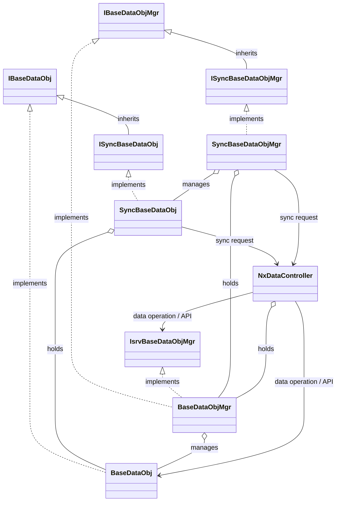

## Base layer (primary CRUD line)

### BaseDataObj
- Performs CRUD operations on individual entities.

### BaseDataObjMgr
- Manages the lifecycle of BaseDataObj.
- Performs CRUD operations on multiple data entries through BaseDataObj.

## Sync layer (synchronized CRUD line)

### SyncBaseDataObj
- Wrapper class of BaseDataObj.
- Provides synchronization functionality with the server.

### SyncBaseDataObjMgr
- Wrapper class of BaseDataObjMgr.
- Uses SyncBaseDataObj to handle synchronization.

## UI abstraction interfaces (ensuring Sync → Base type equivalence)

### ISyncBaseDataObj
- By inheriting IBaseDataObj, SyncBaseDataObj can be treated as the same type.

### ISyncBaseDataObjMgr
- By inheriting IBaseDataObjMgr, SyncBaseDataObjMgr can be treated as the same type.

### IBaseDataObj
- Provides client-side implementation.
- Interface that allows BaseDataObj and SyncBaseDataObj to be treated as the same type.
- Enables UI abstraction by accessing objects through this interface.

### IBaseDataObjMgr
- Provides client-side implementation to the UI.
- Interface that allows BaseDataObjMgr and SyncBaseDataObjMgr to be treated as the same type.
- Enables UI abstraction by accessing objects through this interface.

## Server-side interface

### IsrvBaseDataObjMgr
- Interface for server-side access to BaseDataObjMgr.
- Provides server-side implementation to the API.

## Controller (CRUD line connection point)

### NxDataController
- Receives sync requests.
- Accesses the server DB through IsrvBaseDataObjMgr and BaseDataObjMgr.
