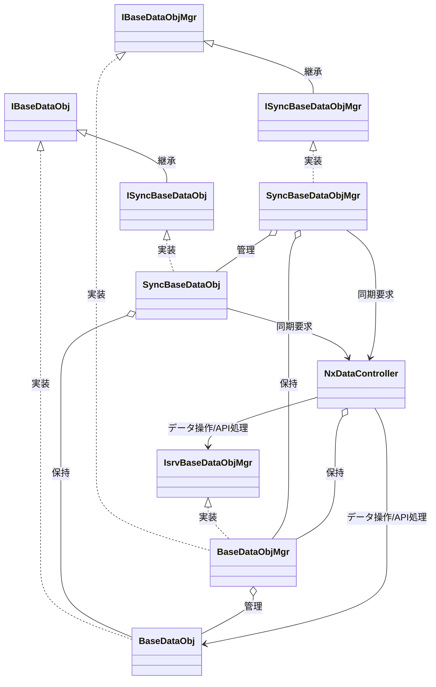

## Base 系（正本 CRUD ライン）

### BaseDataObj
- エンティティ単位の CRUD を行う。

### BaseDataObjMgr
- BaseDataObj のライフサイクルを管理する。
- BaseDataObj を介して複数データの CRUD を行う。

## Sync 系（同期 CRUD ライン）

### SyncBaseDataObj
- BaseDataObj のラッパークラス。
- サーバーとの同期機能を付与する。

### SyncBaseDataObjMgr
- BaseDataObjMgr のラッパークラス。
- SyncBaseDataObj を用いて同期処理を担う。

## UI 抽象化インターフェース（Sync → Base の同型性を保証）

### ISyncBaseDataObj
- IBaseDataObj を継承することで SyncBaseDataObj を同一型として扱える。

### ISyncBaseDataObjMgr
- IBaseDataObjMgr を継承することで SyncBaseDataObjMgr を同一型として扱える。

### IBaseDataObj
- クライアント向けの実装を提供する。
- BaseDataObj と SyncBaseDataObj を同型として扱うためのインターフェース。
- UI 抽象化を可能にする。

### IBaseDataObjMgr
- クライアント向けの実装を UI へ提供する。
- BaseDataObjMgr と SyncBaseDataObjMgr を同型として扱うためのインターフェース。
- UI 抽象化を可能にする。

## サーバー側インターフェース

### IsrvBaseDataObjMgr
- サーバー向け BaseDataObjMgr アクセス用インターフェース。
- サーバー向けの実装を API へ提供する。

## Controller（CRUD ライン接続点）

### NxDataController
- Sync 系からの要求を受け取る。
- IsrvBaseDataObjMgr および BaseDataObjMgr を通してサーバー DB へアクセスする。
