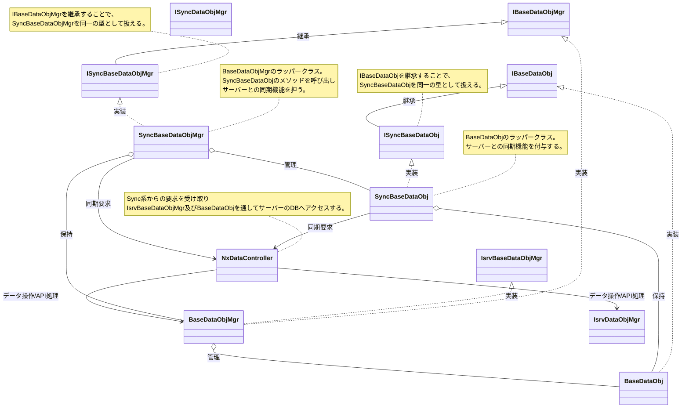

```mermaid
classDiagram
    %% インターフェース
    class IBaseDataObj
    class ISyncBaseDataObj
    class IBaseDataObjMgr
    class IsrvBaseDataObjMgr
    class ISyncDataObjMgr

    %% インターフェース継承
    IBaseDataObj <|-- ISyncBaseDataObj : 継承
    IBaseDataObjMgr <|-- ISyncBaseDataObjMgr : 継承

    %% 実装クラス
    class BaseDataObj
    class SyncBaseDataObj
    class SyncBaseDataObjMgr
    class BaseDataObjMgr
    class NxDataController

    %% 実装関係
    IBaseDataObj <|.. BaseDataObj : 実装
    ISyncBaseDataObj <|.. SyncBaseDataObj : 実装
    IBaseDataObjMgr <|.. BaseDataObjMgr : 実装
    IsrvBaseDataObjMgr <|.. BaseDataObjMgr : 実装
    ISyncBaseDataObjMgr <|.. SyncBaseDataObjMgr : 実装

    %% コンポジション関係（右側はクラス名にする）
    SyncBaseDataObj o-- BaseDataObj : 保持
    SyncBaseDataObjMgr o-- BaseDataObjMgr : 保持

    %% 管理関係（右側もクラス名にする）
    BaseDataObjMgr o-- BaseDataObj : 管理
    SyncBaseDataObjMgr o-- SyncBaseDataObj : 管理

    %% --- 追加した循環構造 ---
    %% Sync系 → HttpController
    SyncBaseDataObj --> NxDataController : 同期要求
    SyncBaseDataObjMgr --> NxDataController : 同期要求

    %% HttpController → DataObjMgr
    NxDataController --> IsrvDataObjMgr : データ操作/API処理
    NxDataController --> BaseDataObjMgr : データ操作/API処理
    
    %% 注釈
    note for SyncBaseDataObj "BaseDataObjのラッパークラス。<br/>サーバーとの同期機能を付与する。"
    note for SyncBaseDataObjMgr "BaseDataObjMgrのラッパークラス。<br/>SyncBaseDataObjのメソッドを呼び出し<br/>サーバーとの同期機能を担う。"
    note for ISyncBaseDataObj "IBaseDataObjを継承することで、<br/>SyncBaseDataObjを同一の型として扱える。"
    note for ISyncBaseDataObjMgr "IBaseDataObjMgrを継承することで、<br/>SyncBaseDataObjMgrを同一の型として扱える。"
    note for NxDataController "Sync系からの要求を受け取り<br/>IsrvBaseDataObjMgr及びBaseDataObjを通してサーバーのDBへアクセスする。"
```